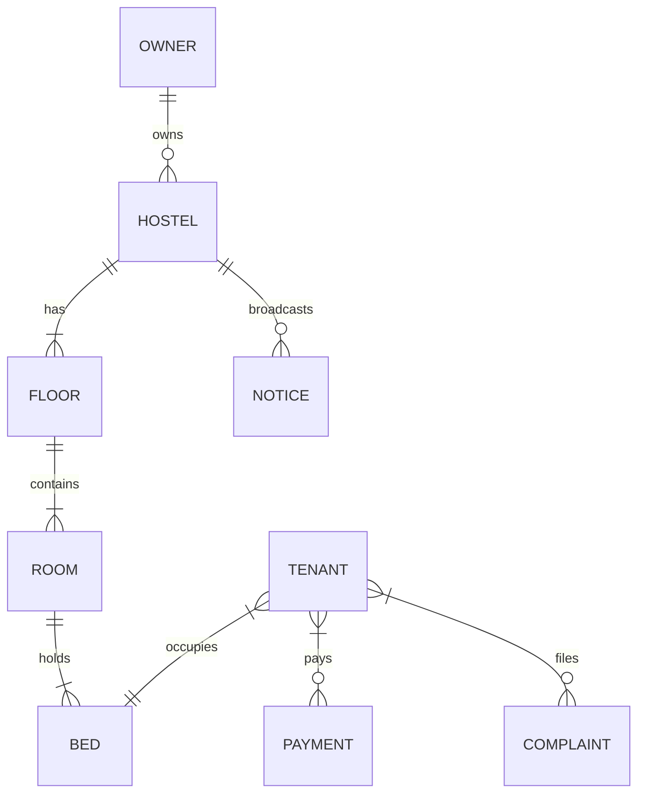

# 🏢 MyHostel Management Pro

MyHostel is a premium, full-stack, multi-tenant **Hostel Management System** designed for modern hostel owners, property managers, and residents. It provides a complete digital operating system for housing facilities, featuring a secure multi-step partner onboarding wizard, automated monthly invoice generation with custom late fees, real-time announcements, resident support tickets, and integrated payment checkout.

---

## ⚡ Key Features

### 👤 User Roles & Dashboards
*   **Hostel Owner Dashboard**: Complete financial analytics, occupancy rates, complaint ticket lists, and property manager delegation tools.
*   **Property Manager Dashboard**: Mid-level access to list tenants, manage rooms/beds, view complaints, and coordinate bed-shift requests.
*   **Resident (Tenant) Portal**: Passwordless login, view/download monthly invoices, pay rent online, submit and track support complaints, and read notices.

### 🛠 Property Management
*   **Dynamic Floor Planner**: Visual mapping tool to manage floors, rooms, and individual bed allocations.
*   **Multi-Tenant Isolation**: Complete logical partitioning. All records carry `ownerId` and `hostelId` attributes to guarantee tenant privacy and owner data isolation.
*   **Bed Shift Manager**: Streamlined tenant requests to swap beds/rooms with admin-side approval workflows.

### 💰 Billing, Invoices & Payments
*   **Automated Rent Engine**: Cron job running daily at midnight to generate invoices based on tenant join anniversary cycles.
*   **Dynamic Late Fee Calculation**: Automated grace-period calculations that apply customized daily interest rates on unpaid overdue invoices.
*   **Razorpay Test Integration**: Built-in mock payment processing for Card, Netbanking, UPI, and Wallet checkout flows.

### 💬 Real-Time Communication
*   **Announcement Noticeboard**: Publish important notices to the entire hostel or specific cohorts.
*   **Socket.io Rooms**: Real-time server-push alerts and read status updates synced directly to the resident's client portal.

---

## 🚀 Tech Stack

| Component | Technology | Description |
| :--- | :--- | :--- |
| **Frontend** | React 19 + Vite 6 | Fast SPA rendering with modern React Hooks |
| **Styling** | Tailwind CSS v4 | Curated HSL color palette, custom Outfit/Inter font pairing |
| **State & Auth** | Context API | Global state management for authentication and Socket.io subscriptions |
| **Backend** | Node.js + Express.js | Structured REST API |
| **Database** | MongoDB + Mongoose | Highly relational schemas built on Document structures |
| **Validation** | Zod | Runtime request body schema validation |
| **Cron Scheduling** | `node-cron` | Asynchronous system jobs for invoice runs |
| **Realtime Push** | Socket.io | Bidirectional WebSocket communication |

---

## 📂 Repository Structure

```text
Hostel-Manager/
├── client/                     # React Single Page Application (SPA)
│   ├── src/
│   │   ├── api/                # Axios instance configuration & request interceptors
│   │   ├── components/         # Reusable layouts & UI components
│   │   │   └── payments/       # Tenant & Admin payment interfaces
│   │   ├── config/             # Client-side env mappings & socket endpoints
│   │   ├── context/            # AuthContext & SocketContext providers
│   │   ├── layouts/            # DashboardLayout (Sidebar, Topbar navigation)
│   │   ├── pages/              # Login, Onboarding wizard, and Admin/Tenant views
│   │   ├── store/              # Frontend store hooks
│   │   └── utils/              # Helper utilities (error parsing, formatting)
│   └── vite.config.js          # Vite config with Dev proxy settings
│
├── server/                     # Node/Express REST API Service
│   ├── src/
│   │   ├── config/             # DB client & environment configuration (Zod validations)
│   │   ├── controllers/        # Express route handlers
│   │   ├── middleware/         # Auth, permission check, validation, rate limiting
│   │   ├── models/             # Mongoose Schemas (ActivityLog, Bed, Tenant, etc.)
│   │   ├── routes/             # Core routing tables
│   │   ├── services/           # Business logic modules (Activity, Cron engines)
│   │   ├── utils/              # Global helpers (CORS delegates, OTP utils)
│   │   └── validators/         # Zod request validators
│   └── scripts/                # Database configuration & seeding helpers
│
└── docs/                       # Auxiliary documentation files
    ├── DATA_MODEL.md           # Multi-hostel data schema hierarchy
    └── DEPLOYMENT.md           # Detailed Render & Vercel deployment guides
```

---

## 💾 Relational Data Model

All schemas are isolated by `ownerId` and `hostelId`.



---

## 🛣 API Endpoint Specifications

All endpoints are prefixed with `/api`.

### 🔑 Authentication Routes (`/auth`)

| Method | Endpoint | Description | Auth Required | Payload / Parameters |
| :--- | :--- | :--- | :--- | :--- |
| `POST` | `/auth/register` | Register a new Owner | None | `name, email, password, phone` |
| `POST` | `/auth/login` | Login user (Owner/Manager) | None | `email, password` |
| `POST` | `/auth/tenant/send-otp` | Request OTP for Tenant passwordless login | None | `phone` |
| `POST` | `/auth/tenant/verify-otp` | Verify OTP & Login Tenant | None | `phone, otp` |
| `POST` | `/auth/refresh` | Exchange refresh token for new access token | None | Cookie: `refreshToken` |
| `POST` | `/auth/logout` | Revoke tokens & destroy session | None | Cookie: `refreshToken` |
| `GET` | `/auth/me` | Fetch active user context | JWT | None |
| `POST` | `/auth/switch-hostel` | Switch active hostel dashboard context | JWT (Owner) | `hostelId` |
| `PATCH` | `/auth/profile` | Update profile information | JWT | `name, phone` |
| `PATCH` | `/auth/password` | Update account password | JWT | `oldPassword, newPassword` |

### 🛠 Owner / Manager Routes (`/owner`)

| Method | Endpoint | Description | Role Required | Payload / Parameters |
| :--- | :--- | :--- | :--- | :--- |
| `GET` | `/owner/dashboard` | Fetch dashboard metric summary cards | Owner / Manager | None |
| `GET` | `/owner/occupancy` | Fetch live room occupancy details | Owner / Manager | None |
| `GET` | `/owner/hostel` | Fetch active hostel metadata | Owner / Manager | None |
| `GET` | `/owner/structure` | Fetch nested floor-room-bed layout | Owner / Manager | None |
| `GET` | `/owner/floors` | List all floors | Owner / Manager | None |
| `POST` | `/owner/floors` | Create a floor | Owner / Manager | `number, name` |
| `GET` | `/owner/rooms` | List all rooms | Owner / Manager | None |
| `GET` | `/owner/beds` | List all beds | Owner / Manager | None |
| `GET` | `/owner/tenants` | List all current tenants | Owner / Manager | None |
| `POST` | `/owner/tenants` | Add new tenant profile | Owner / Manager | `name, email, phone, monthlyRent, joinDate` |
| `PATCH` | `/owner/tenants/:id` | Update tenant details | Owner / Manager | `name, email, phone, monthlyRent` |
| `POST` | `/owner/tenants/:id/assign-bed` | Assign a tenant to a specific room & bed | Owner / Manager | `bedId` |
| `DELETE` | `/owner/tenants/:id` | Evict or remove tenant | Owner / Manager | None |
| `GET` | `/owner/complaints` | View all support complaints | Owner / Manager | None |
| `PATCH` | `/owner/complaints/:id` | Update ticket status & comments | Owner / Manager | `status, remarks` |
| `GET` | `/owner/payments` | List all payment receipts & bills | Owner / Manager | None |
| `POST` | `/owner/payments` | Manually record or create a bill | Owner | `tenantId, bedId, amount, paymentMonth, year, dueDate` |
| `GET` | `/owner/notices` | List all broadcasted notice board items | Owner / Manager | None |
| `POST` | `/owner/notices` | Broadcast a new notice announcement | Owner / Manager | `title, content, targetAudience` |
| `DELETE` | `/owner/notices/:id` | Delete an announcement | Owner / Manager | None |
| `GET` | `/owner/managers` | List all delegated managers | Owner | None |
| `POST` | `/owner/managers` | Delegate property manager role | Owner | `name, email, password, phone` |

### 🛌 Tenant Routes (`/tenant`)

| Method | Endpoint | Description | Payload |
| :--- | :--- | :--- | :--- |
| `GET` | `/tenant/dashboard` | Fetch resident info dashboard | None |
| `GET` | `/tenant/room` | Fetch resident's assigned room and roommate list | None |
| `GET` | `/tenant/payments` | List all bills & historical receipts | None |
| `POST` | `/tenant/payments/create-order` | Initialize a Razorpay payment order for rent | `paymentId` (system bill record ID) |
| `POST` | `/tenant/payments/verify` | Verify Razorpay transaction signature | `razorpay_order_id, razorpay_payment_id, razorpay_signature` |
| `GET` | `/tenant/complaints` | List resident filed complaints | None |
| `POST` | `/tenant/complaints` | File a new maintenance/service ticket | `title, description, category, priority` |
| `GET` | `/tenant/notices` | Fetch announcements and notifications | None |
| `POST` | `/tenant/notices/:id/read` | Mark a specific notice announcement as read | None |
| `POST` | `/tenant/bed-shift-requests` | Request room/bed migration request | `targetRoomId, targetBedId, reason` |

---

## 🔌 Socket.io Channels & Event Emitters

The real-time sync mechanism uses Socket.io rooms grouped by `hostelId` to prevent cross-property message leaks:
*   **On Connect**: Client emits `join_hostel` with parameter `hostelId`.
*   **Rooms**: Server places sockets into room identifier: `hostel_{hostelId}`.
*   **Notices**: Publishing a notice broadcasts to the socket room instantly:
    ```javascript
    req.app.get("io").to(`hostel_${hostelId}`).emit("new_notice", notice);
    ```

---

## 🕒 Cron & Billing Engine

The system contains an automated daily billing and ledger maintenance engine:
1.  **Anniversary Billing**: Runs every day at `00:00` (midnight). It streams active tenants using Mongoose Cursor. If the current date matches the tenant's join cycle anniversary (or end of month adjustments), it creates a pending `Payment` document for the cycle.
2.  **Grace Period & Late Fees**: Identifies all unpaid or overdue payments. If the current time exceeds the `dueDate` beyond the hostel's customized grace period (`lateFeeGracePeriodDays`), it automatically applies the daily compounding late rate (`lateFeeDailyRate`) to update `fineAmount` and marks the status as `overdue`.

---

## 🛠 Local Setup & Installation

### Prerequisites
*   Node.js (v18 or above recommended)
*   MongoDB Atlas (cloud instance) or Local MongoDB daemon running

### 1. Configure the Backend Service

```bash
# Navigate to the backend directory
cd server

# Install dependecies
npm install

# Copy environment template file
cp .env.example .env
```

Open `.env` and configure your credentials:
```env
PORT=5000
MONGO_URI=mongodb+srv://<username>:<password>@cluster0.xxxxx.mongodb.net
MONGO_DB_NAME=smart-hostel
JWT_SECRET=your_jwt_access_secret_key_minimum_16_characters
REFRESH_TOKEN_SECRET=your_jwt_refresh_secret_key_minimum_16_characters
CLIENT_URL=http://localhost:5173
MOCK_OTP=true
RAZORPAY_KEY_ID=rzp_test_yourKeyId
RAZORPAY_KEY_SECRET=yourRazorpaySecret
```
> [!NOTE]
> Setting `MOCK_OTP=true` bypasses physical SMS gateways. When logging in a tenant, use `123456` as the standard verification code.

Start the backend in development hot-reload mode:
```bash
npm run dev
```

### 2. Configure the Frontend Client

```bash
# Navigate to the client directory
cd ../client

# Install dependencies
npm install

# Copy environment template file
cp .env.example .env.development
```

Configure `.env.development`:
```env
VITE_DEV_PROXY_TARGET=http://localhost:5000
VITE_RAZORPAY_KEY_ID=rzp_test_yourKeyId
```

Start Vite client local server:
```bash
npm run dev
```
Vite will boot on `http://localhost:5173`. Any client calls to `/api/*` will automatically be proxied to `http://localhost:5000` via Vite's proxy router, neutralizing local dev CORS issues.

---

## 🌐 Production Deployments

### Backend (Render Web Service)
1.  Select the `server` directory as project root directory.
2.  Build command: `npm install`.
3.  Start command: `npm start`.
4.  Set the following environment variables:
    *   `NODE_ENV=production`
    *   `CLIENT_URL=https://your-frontend-app.vercel.app`
    *   Configure `MONGO_URI`, JWT secret variables, and Razorpay API credentials.

### Frontend (Vercel)
1.  Select the `client` directory as project root directory.
2.  Build command: `npm run build` (output directory: `dist`).
3.  Set environment variables:
    *   `VITE_API_URL=https://your-backend-app.onrender.com`
    *   `VITE_RAZORPAY_KEY_ID=rzp_test_yourKeyId`
4.  Ensure `vercel.json` is configured in the `client` folder to route all client paths back to `index.html` (SPA routing mode).

---

## 🩺 Troubleshooting

> [!WARNING]
> **Database Cold Starts & False CORS Errors**: When deployed to Render's free tier, the backend web service spins down after 15 minutes of inactivity. When a request comes in, it takes ~30 seconds to boot up. During this period, the server fails to respond, causing the browser to throw a misleading CORS exception instead of a 504. Send a manual `GET` request to `https://your-app.onrender.com/api/health` first to warm up the server.

*   **Cookie Sync Failure**: In production, access tokens are sent securely. Ensure the backend has trust proxies enabled (`app.set("trust proxy", 1)`) and headers utilize `secure: true` and `SameSite: "None"`.
*   **Vite Hot-Reload Issues**: If styles or proxy paths do not resolve after modifying `.env.development`, terminate the client process and run `npm run dev` again to rebuild Vite's server configuration context.
# StaySync
