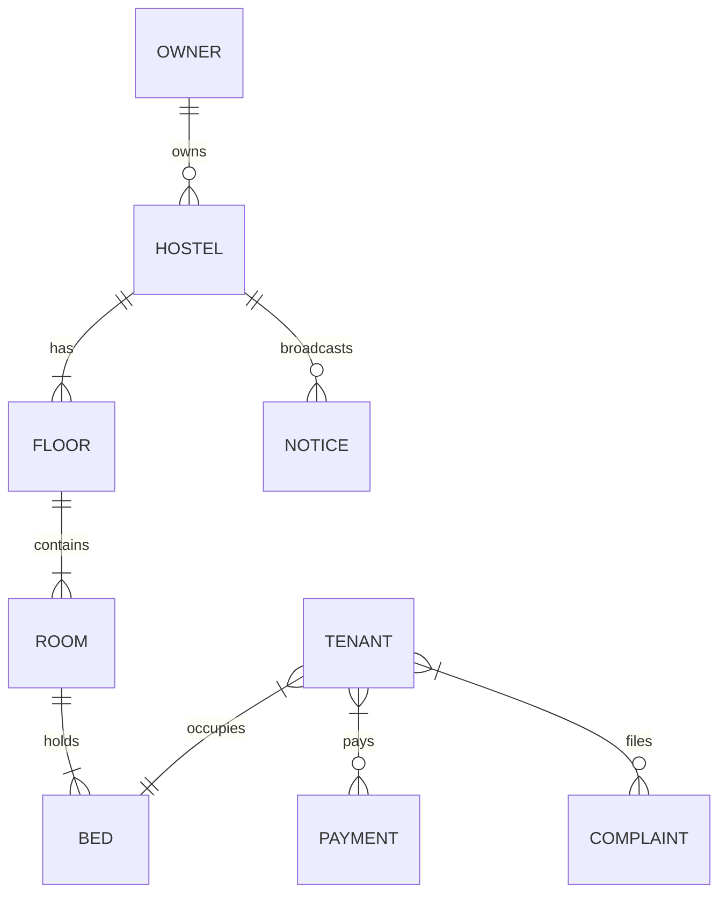

# 🏢 MyHostel Management Pro

MyHostel is a premium, full-stack, multi-tenant **Hostel Management System** designed for modern hostel owners and residents. It provides a complete digital operating system for housing facilities, featuring automated monthly invoice generation, real-time announcements, resident support tickets, and admin-approved payment requests.

---

## ⚡ Key Features

### 👤 User Roles & Dashboards
*   **Admin Dashboard**: Complete financial analytics, occupancy rates, complaint ticket lists, tenant management, and real-time notices.
*   **Resident (Tenant) Portal**: Passwordless OTP login, view monthly invoices, submit payment requests, file and track support complaints, and read notices.

### 🛠 Property Management
*   **Dynamic Floor Planner**: Visual mapping tool to manage floors, rooms, and individual bed allocations.
*   **Multi-Tenant Isolation**: Complete logical partitioning. All records carry `ownerId` and `hostelId` attributes to guarantee tenant privacy and owner data isolation.
*   **Bed Shift Manager**: Streamlined tenant requests to swap beds/rooms with admin-side approval workflows.

### 💰 Billing, Invoices & Payments
*   **Automated Rent Engine**: Monthly cron (2nd of the month) generates a rent invoice for every active tenant, due on the 7th.
*   **Admin-Approved Payment Requests**: Tenants submit a payment request for an invoice; the owner approves or rejects it to record the payment.

### 💬 Real-Time Communication
*   **Announcement Noticeboard**: Publish important notices to the entire hostel or specific cohorts.
*   **Socket.io Rooms**: Real-time server-push alerts and read status updates synced directly to the resident's client portal.

---

## 🚀 Tech Stack

| Component | Technology | Description |
| :--- | :--- | :--- |
| **Frontend** | React 19 + Vite 6 | Fast SPA rendering with modern React Hooks |
| **Styling** | Tailwind CSS v4 | Curated HSL color palette, custom Outfit/Inter font pairing |
| **State & Auth** | Context API | Global state management for authentication and Socket.io subscriptions |
| **Backend** | Node.js + Express.js | Structured REST API |
| **Database** | MongoDB + Mongoose | Highly relational schemas built on Document structures |
| **Validation** | Zod | Runtime request body schema validation |
| **Cron Scheduling** | `node-cron` | Monthly invoice runs, profile checks, tenant cleanup |
| **Realtime Push** | Socket.io | Bidirectional WebSocket communication |

---

## 📂 Repository Structure

```text
Hostel-Manager/
├── client/                     # React Single Page Application (SPA)
│   ├── src/
│   │   ├── api/                # Axios instance configuration & request interceptors
│   │   ├── components/         # Reusable layouts & UI components
│   │   │   └── payments/       # Tenant & Admin payment interfaces
│   │   ├── config/             # Client-side env mappings & socket endpoints
│   │   ├── context/            # AuthContext & SocketContext providers
│   │   ├── layouts/            # DashboardLayout (Sidebar, Topbar navigation)
│   │   ├── pages/              # Login, Admin login, and Admin/Tenant views
│   │   ├── store/              # Frontend store hooks
│   │   └── utils/              # Helper utilities (error parsing, formatting)
│   └── vite.config.js          # Vite config with Dev proxy settings
│
├── server/                     # Node/Express REST API Service
│   ├── src/
│   │   ├── config/             # DB client & environment configuration (Zod validations)
│   │   ├── controllers/        # Express route handlers
│   │   ├── middleware/         # Auth, permission check, validation, rate limiting
│   │   ├── models/             # Mongoose Schemas (ActivityLog, Bed, Tenant, etc.)
│   │   ├── routes/             # Core routing tables
│   │   ├── services/           # Business logic modules (Activity, Cron engines)
│   │   ├── utils/              # Global helpers (CORS delegates, OTP utils)
│   │   └── validators/         # Zod request validators
│   └── scripts/                # Database configuration & seeding helpers
│
└── docs/                       # Auxiliary documentation files
    ├── DATA_MODEL.md           # Multi-hostel data schema hierarchy
    └── DEPLOYMENT.md           # Detailed Render & Vercel deployment guides
```

---

## 💾 Relational Data Model

All schemas are isolated by `ownerId` and `hostelId`.


```mermaid
erDiagram
    OWNER ||--o{ HOSTEL : "owns"
    HOSTEL ||--|{ FLOOR : "has"
    FLOOR ||--|{ ROOM : "contains"
    ROOM ||--|{ BED : "holds"
    TENANT }|--|| BED : "occupies"
    TENANT }|--o{ PAYMENT : "pays"
    TENANT }|--o{ COMPLAINT : "files"
    HOSTEL ||--o{ NOTICE : "broadcasts"
```

---

## 🛣 API Endpoint Specifications

All endpoints are prefixed with `/api`.

### 🔑 Authentication Routes (`/auth`)

| Method | Endpoint | Description | Auth Required | Payload / Parameters |
| :--- | :--- | :--- | :--- | :--- |
| `POST` | `/auth/register` | Register a new Owner | None | `name, email, password, phone` |
| `POST` | `/auth/login` | Login user (Owner/Admin) | None | `email, password` |
| `POST` | `/auth/tenant/send-otp` | Request OTP for Tenant passwordless login | None | `phone` |
| `POST` | `/auth/tenant/verify-otp` | Verify OTP & Login Tenant | None | `phone, otp` |
| `POST` | `/auth/refresh` | Exchange refresh token for new access token | None | Cookie: `refreshToken` |
| `POST` | `/auth/logout` | Revoke tokens & destroy session | None | Cookie: `refreshToken` |
| `GET` | `/auth/me` | Fetch active user context | JWT | None |
| `POST` | `/auth/switch-hostel` | Switch active hostel dashboard context | JWT (Owner) | `hostelId` |
| `PATCH` | `/auth/profile` | Update profile information | JWT | `name, phone` |
| `PATCH` | `/auth/password` | Update account password | JWT | `oldPassword, newPassword` |

### 🛠 Owner Routes (`/owner`)

| Method | Endpoint | Description | Role Required | Payload / Parameters |
| :--- | :--- | :--- | :--- | :--- |
| `GET` | `/owner/dashboard` | Fetch dashboard metric summary cards | Owner | None |
| `GET` | `/owner/occupancy` | Fetch live room occupancy details | Owner | None |
| `GET` | `/owner/hostel` | Fetch active hostel metadata | Owner | None |
| `GET` | `/owner/structure` | Fetch nested floor-room-bed layout | Owner | None |
| `GET` | `/owner/floors` | List all floors | Owner | None |
| `POST` | `/owner/floors` | Create a floor | Owner | `number, name` |
| `GET` | `/owner/rooms` | List all rooms | Owner | None |
| `GET` | `/owner/beds` | List all beds | Owner | None |
| `GET` | `/owner/tenants` | List all current tenants | Owner | None |
| `POST` | `/owner/tenants` | Add new tenant profile | Owner | `name, email, phone, monthlyRent, joinDate` |
| `PATCH` | `/owner/tenants/:id` | Update tenant details | Owner | `name, email, phone, monthlyRent` |
| `POST` | `/owner/tenants/:id/assign-bed` | Assign a tenant to a specific room & bed | Owner | `bedId` |
| `DELETE` | `/owner/tenants/:id` | Evict or remove tenant | Owner | None |
| `GET` | `/owner/complaints` | View all support complaints | Owner | None |
| `PATCH` | `/owner/complaints/:id` | Update ticket status & comments | Owner | `status, remarks` |
| `GET` | `/owner/payments` | List all payment receipts & bills | Owner | None |
| `POST` | `/owner/payments` | Manually record or create a bill | Owner | `tenantId, bedId, amount, paymentMonth, year, dueDate` |
| `GET` | `/owner/notices` | List all broadcasted notice board items | Owner | None |
| `POST` | `/owner/notices` | Broadcast a new notice announcement | Owner | `title, content, targetAudience` |
| `DELETE` | `/owner/notices/:id` | Delete an announcement | Owner | None |
| `GET` | `/owner/payment-requests` | List tenant-submitted payment requests | Owner | None |
| `PATCH` | `/owner/payment-requests/:id` | Approve or reject a payment request | Owner | `status` |

### 🛌 Tenant Routes (`/tenant`)

| Method | Endpoint | Description | Payload |
| :--- | :--- | :--- | :--- |
| `GET` | `/tenant/dashboard` | Fetch resident info dashboard | None |
| `GET` | `/tenant/room` | Fetch resident's assigned room and roommate list | None |
| `GET` | `/tenant/payments` | List all bills & historical receipts | None |
| `POST` | `/tenant/payment-requests` | Submit a payment request for owner approval | `paymentMonth, year, amount, paymentProof, notes` |
| `GET` | `/tenant/payment-requests` | List own payment requests | None |
| `GET` | `/tenant/complaints` | List resident filed complaints | None |
| `POST` | `/tenant/complaints` | File a new maintenance/service ticket | `title, description, category, priority` |
| `GET` | `/tenant/notices` | Fetch announcements and notifications | None |
| `POST` | `/tenant/notices/:id/read` | Mark a specific notice announcement as read | None |
| `POST` | `/tenant/bed-shift-requests` | Request room/bed migration request | `targetRoomId, targetBedId, reason` |

---

## 🔌 Socket.io Channels & Event Emitters

The real-time sync mechanism uses Socket.io rooms grouped by `hostelId` to prevent cross-property message leaks:
*   **On Connect**: Client emits `join_hostel` with parameter `hostelId`.
*   **Rooms**: Server places sockets into room identifier: `hostel_{hostelId}`.
*   **Notices**: Publishing a notice broadcasts to the socket room instantly:
    ```javascript
    req.app.get("io").to(`hostel_${hostelId}`).emit("new_notice", notice);
    ```

---

## 🕒 Cron & Billing Engine

The system runs the following scheduled jobs (`server/src/services/cronService.js`):
1.  **Monthly Rent Generation** (`0 0 2 * *`): On the 2nd of each month, creates an unpaid rent invoice for every active tenant (due on the 7th). Skips tenants who already have an invoice for the month/year.
2.  **Incomplete Profile Check** (`0 3 * * *`): Scans all hostels for tenants with incomplete profiles and raises/auto-resolves system notices.
3.  **Tenant Cleanup** (`0 1 * * *`): Permanently deletes inactive tenants past their 10-day `scheduledDeletionDate` and cascade-deletes their related records.

A GitHub Actions keep-warm workflow pings the Railway health endpoint (`https://<your-service>.up.railway.app/api/health`, set via the `RAILWAY_HEALTH_URL` repository variable) every 5 minutes as an uptime monitor (Railway paid services run continuously, so this is optional).

---

## 🛠 Local Setup & Installation

### Prerequisites
*   Node.js (v18 or above recommended)
*   MongoDB Atlas (cloud instance) or Local MongoDB daemon running

### 1. Configure the Backend Service

```bash
# Navigate to the backend directory
cd server

# Install dependecies
npm install

# Copy environment template file
cp .env.example .env
```

Open `.env` and configure your credentials:
```env
PORT=5000
MONGO_URI=mongodb+srv://<username>:<password>@cluster0.xxxxx.mongodb.net
MONGO_DB_NAME=smart-hostel
JWT_SECRET=your_jwt_access_secret_key_minimum_16_characters
REFRESH_TOKEN_SECRET=your_jwt_refresh_secret_key_minimum_16_characters
CLIENT_URL=http://localhost:5173
RESEND_API_KEY=re_...      # required for any OTP delivery — see note below
```
> [!NOTE]
> OTPs are random 6-digit codes delivered exclusively through **Resend** (`resend.emails.send`). There is no development fallback: without `RESEND_API_KEY` an OTP request fails with a clear config error (development included), and OTPs are never logged or returned in API responses in any environment. Production additionally requires `RESEND_FROM_EMAIL` — startup fails without both.

Start the backend in development hot-reload mode:
```bash
npm run dev
```

### 2. Configure the Frontend Client

```bash
# Navigate to the client directory
cd ../client

# Install dependencies
npm install

# Copy environment template file
cp .env.example .env.development
```

Configure `.env.development`:
```env
VITE_DEV_PROXY_TARGET=http://localhost:5000
```

Start Vite client local server:
```bash
npm run dev
```
Vite will boot on `http://localhost:5173`. Any client calls to `/api/*` will automatically be proxied to `http://localhost:5000` via Vite's proxy router, neutralizing local dev CORS issues.

---

## 🌐 Production Deployments

Production topology: **Vercel serves the static React SPA; Railway runs the backend** (REST API + Socket.IO + cron).

### Vercel (static frontend)
`vercel.json` builds `client/dist` and serves it as a static SPA (every path rewrites to `/index.html`). There is no `/api` rewrite — the backend lives on Railway.
1.  Project root: repository root. Build command: `cd client && npx vite build` (output: `client/dist`).
2.  Set `VITE_API_URL` (build-time) to the Railway service, e.g. `https://your-backend-app.up.railway.app`. The axios base URL and Socket.IO origin both derive from it.

### Railway (long-running Node service — required)
Create a Railway service from this repo with Root Directory `server`; `server/railway.toml` handles the build (`npm install`), start (`npm start`), and `/api/health` healthcheck. Paid Railway plans run continuously, so Socket.IO and the `node-cron` jobs stay alive.
1.  Railway → New Project → Deploy from GitHub → select this repo → service Root Directory `server` → Generate Domain.
2.  Set environment variables: `CLIENT_URL=https://your-frontend-app.vercel.app`, `MONGO_URI`, `JWT_SECRET`, `REFRESH_TOKEN_SECRET`, `RESEND_API_KEY`, `RESEND_FROM_EMAIL`, plus the ADMIN_* vars (see `docs/DEPLOYMENT.md`).

---

## 🩺 Troubleshooting

> [!WARNING]
> **Backend unreachable**: The Railway service must be on a paid plan (continuous uptime) for cron jobs and WebSockets. If `/api/health` is slow or the client shows network errors, check the service is deployed, the Root Directory is `server`, and the environment variables are set. Send a manual `GET` request to `https://<your-service>.up.railway.app/api/health` to confirm.

*   **Cookie Sync Failure**: In production, access tokens are sent securely. Ensure the backend has trust proxies enabled (`app.set("trust proxy", 1)`) and headers utilize `secure: true` and `SameSite: "None"`.
*   **Vite Hot-Reload Issues**: If styles or proxy paths do not resolve after modifying `.env.development`, terminate the client process and run `npm run dev` again to rebuild Vite's server configuration context.
# StaySync
